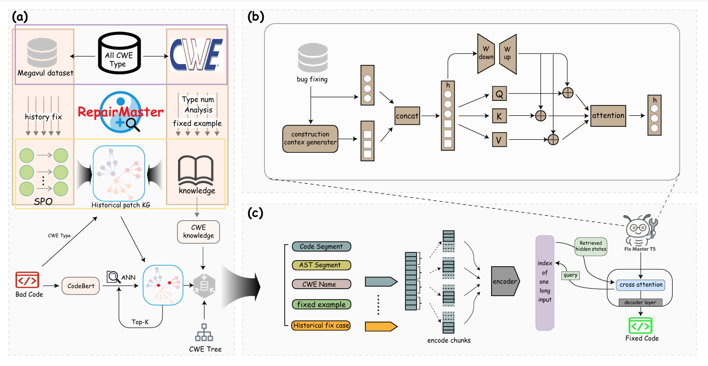

# RepairMaster

[](https://www.python.org/)[](https://pytorch.org/)

This repository contains the official implementation of the method proposed in the paper:

> **Context-Aware LLM-Based Program Repair Enhanced by Historical Patch Retrieval**

For comprehensive details on data preprocessing, experimental design, and result analysis, please refer to the relevant chapters in the paper.




## Resources

* In the replication, we provide:
  * the scripts we used to:
    * `train.sh`: train models.
    * `infer.sh`:  inference models.
  * the source code we used to:
    * `train_model.py`: the main code for training/validating.
    * `test_model.py`: the main code for testing.
    * `src/`: the utils, model, data preprocessing, KG Construction etc.
    * `checkpoint_final`: Storing Results.
    * `CodeBert`: Storing CodeBert models downloaded from [huggingface](https://huggingface.co/).
    * `CodeT5`: Storing CodeT5 models downloaded from [huggingface](https://huggingface.co/).
    * `evaluator`: Toolkit for model evaluation.
    * `finetune`: the main code for structured domain fine-tuning.
    * `vulfix_data`: datasets and the main code for data processing. 
* `requirements.txt` contains the dependencies needed.
* If you meet OutOfMemoryError: please note that you typically need around 40GB or more of GPU memory to run RepairMaster.
* [Here](https://drive.google.com/drive/folders/1GOCR4EvPp0AAipNJ0Zu_ggyTlnjyYyLB) is the full trained model, if you need to use it directly for inference. Please download it and place it in the '. /checkpoint_final/final_model/checkpoint/best_dev/' directory.
* [Here](https://drive.google.com/drive/folders/1tTr4z8oO40Vw_aIDTUSLanlU3W4PXz2T) is the fine-tuned CodeT5 model. Please download it and rename it to '. /finetune_with_ast/pytorch_model.bin' and put it in the root folder。
* [Here](https://drive.google.com/drive/folders/1dr4fcafpJH5vx3hLsTkwI2Zpoba1zqYJ) is the dataset megavul used to build the Knowledge Graph. please download it and place it in the '. /vulfix_data/KGKB/' directory.


## Install dependencies

 Please install them first.
```
unzip RepairMaster.zip
cd RepairMaster
conda create -n RepairMaster python=3.8 
conda activate RepairMaster
pip install -r requirements.txt
```
- We highly recommend you check out this [installation guide](https://pytorch.org/) for the "torch" library so you can install the appropriate version on your device.
- To utilize GPU (optional), you also need to install the CUDA library, you may want to check out this [installation guide](https://docs.nvidia.com/cuda/cuda-quick-start-guide/index.html).

## Directly Reproduce Main Results:

 ```
 python calculate_metrics_all_models.py
 ```

## Train and Test 

To replicate RepairMaster, ensure that `RepairMaster/` is in the root path of this project. 

Training:
```
bash train.sh 
```

Testing:
```
bash test.sh
```

## Python Script for Creating a Knowledge Graph of Historical Vulnerabilities via Noe4j
```
python src/noe4j_history_case.py
```

## Pyhton Scripts code for performing structured fine-tuning

```
python finetune/finetune.py
```


